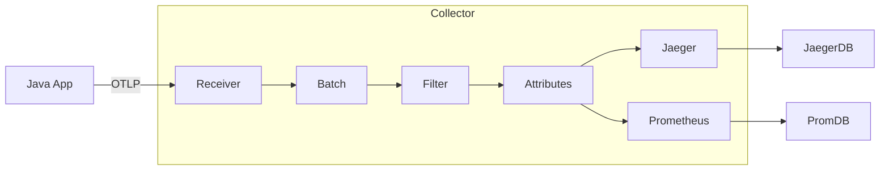

# The OpenTelemetry Collector: Deep Dive

*Part 7 of an 8-part series on implementing observability in Java microservices*

---

The **OpenTelemetry Collector** is the unsung hero of the observability stack. It's a vendor-neutral proxy that sits between your applications and your backend (Jaeger, Datadog, Prometheus).

> [!NOTE]
> **Try It Yourself**: The [`otel-demo`](https://github.com/laxman-sharma/otel-demo) directory contains a fully functional collector setup with three microservices. Run `docker-compose up` to see the collector in action with Jaeger, Prometheus, and Grafana.

## Why not send directly?

You *can* send telemetry directly from your Java app to Jaeger. But what if you want to switch to Datadog later? You'd have to redeploy every single microservice with new credentials and SDK configurations.

With the Collector:
1.  **Apps** send to **Collector** (via OTLP).
2.  **Collector** sends to **Jaeger + Datadog + S3**.

Your apps never know where the data ends up.

## The Architecture: Receivers, Processors, Exporters

The Collector is an ETL (Extract, Transform, Load) pipeline.



### 1. Receivers (Input)
How data gets IN.
*   **OTLP**: The standard OTel protocol (gRPC/HTTP).
*   **Jaeger/Zipkin**: For legacy apps.
*   **Host Metrics**: CPU/Memory of the collector host itself.

### 2. Processors (Transformation)
The magic happens here. Processors run **in order**.

#### The Batch Processor (Mandatory)
Buffers telemetry to send in chunks. Drastically reduces network calls.
```yaml
processors:
  batch:
    timeout: 1s
    send_batch_size: 1024
```

#### The Memory Limiter (Safety)
Prevents the Collector from crashing (OOM) if traffic spikes. **Always** put this first.
```yaml
processors:
  memory_limiter:
    check_interval: 1s
    limit_mib: 1000        # Soft limit
    spike_limit_mib: 200   # Hard buffer
```

#### The Attributes Processor (Scrubbing PII)
Use this to remove sensitive data like passwords or credit cards *before* they leave your infrastructure.
```yaml
processors:
  attributes:
    actions:
      - key: db.statement
        action: delete  # Don't log raw SQL queries
      - key: credit_card
        action: hash    # Hash sensitive fields
```

### 3. Exporters (Output)
Where data goes.
*   **OTLP**: To another collector (load balancing).
*   **Prometheus**: Exposes a `/metrics` endpoint for scraping.
*   **Logging**: Prints to stdout (great for debugging).

## The "Gateway" vs "Agent" Pattern

### Pattern A: Despair (Direct)
Every app talks to the vendor.
*   **Pros**: Easy demo.
*   **Cons**: Security nightmare (API keys in every app).

### Pattern B: The Agent (DaemonSet)
One collector on every Kubernetes Node.
*   **Pros**: Apps talk to `localhost`. Local caching.
*   **Cons**: Resource intensive on small clusters.

### Pattern C: The Gateway (Deployment)
A centralized cluster of Collectors.
*   **Pros**: Central management. Scalable.
*   **Cons**: Single point of failure (run HA replicas!).

## Configuration Example

Here is a production-ready `config.yaml`:

```yaml
receivers:
  otlp:
    protocols:
      grpc: { endpoint: "0.0.0.0:4317" }
      http: { endpoint: "0.0.0.0:4318" }

processors:
  memory_limiter:
    check_interval: 1s
    limit_mib: 1536
    spike_limit_mib: 512
  batch:
    timeout: 1s
  resourcedetection:
    detectors: [env, system] # Add 'host.name', 'os.type' automatically

exporters:
  otlp/honeycomb:
    endpoint: "api.honeycomb.io:443"
    headers:
      "x-honeycomb-team": "${HONEYCOMB_API_KEY}"
  logging:
    verbosity: detailed

service:
  pipelines:
    traces:
      receivers: [otlp]
      processors: [memory_limiter, resourcedetection, batch]
      exporters: [otlp/honeycomb]
```

---

Enter the **OpenTelemetry Collector**—the central nervous system of your observability pipeline.

## Why You Need the Collector

Direct export from apps:

```
App 1 → Jaeger
App 2 → Jaeger
App 3 → Jaeger
```

Problems:
- Every app needs backend credentials
- Can't change backends without app redeployment
- No centralized sampling or filtering
- Apps impacted by backend downtime

With the Collector:

```
App 1 ─┐
App 2 ─┼→ Collector → Jaeger
App 3 ─┘             → Prometheus
                     → Datadog
```

Benefits:
- Single configuration point
- Apps are insulated from backend changes
- Centralized sampling and transformation
- Buffering during backend outages

## Collector Architecture

The Collector has three main components:

```
┌──────────────────────────────────────────────────────┐
│                  OTel Collector                       │
│                                                       │
│  Receivers    →    Processors    →    Exporters      │
│  (OTLP, Jaeger)    (batch, filter)   (OTLP, Prom)   │
└──────────────────────────────────────────────────────┘
```

- **Receivers**: Ingest telemetry (OTLP, Jaeger, Zipkin, Kafka)
- **Processors**: Transform, filter, batch, sample
- **Exporters**: Send to backends (Jaeger, Prometheus, vendors)

## Basic Collector Configuration

Create `otel-collector-config.yaml`:

```yaml
receivers:
  otlp:
    protocols:
      grpc:
        endpoint: 0.0.0.0:4317
      http:
        endpoint: 0.0.0.0:4318

processors:
  batch:
    timeout: 5s
    send_batch_size: 1000
  
  resource:
    attributes:
      - key: environment
        value: production
        action: insert

exporters:
  otlp/jaeger:
    endpoint: jaeger:4317
    tls:
      insecure: true
  
  prometheus:
    endpoint: 0.0.0.0:8889
  
  logging:
    verbosity: detailed

service:
  pipelines:
    traces:
      receivers: [otlp]
      processors: [batch, resource]
      exporters: [otlp/jaeger, logging]
    
    metrics:
      receivers: [otlp]
      processors: [batch, resource]
      exporters: [prometheus]
    
    logs:
      receivers: [otlp]
      processors: [batch]
      exporters: [logging]
```

## Docker Compose with Collector

Complete stack:

```yaml
version: '3.8'
services:
  otel-collector:
    image: otel/opentelemetry-collector-contrib:0.91.0
    container_name: otel-collector
    command: ["--config=/etc/otel-collector-config.yaml"]
    volumes:
      - ./otel-collector-config.yaml:/etc/otel-collector-config.yaml
    ports:
      - "4317:4317"   # OTLP gRPC
      - "4318:4318"   # OTLP HTTP
      - "8889:8889"   # Prometheus metrics
    depends_on:
      - jaeger

  jaeger:
    image: jaegertracing/all-in-one:1.53
    ports:
      - "16686:16686"
    environment:
      - COLLECTOR_OTLP_ENABLED=true

  prometheus:
    image: prom/prometheus:v2.48.0
    ports:
      - "9090:9090"
    volumes:
      - ./prometheus.yml:/etc/prometheus/prometheus.yml

  grafana:
    image: grafana/grafana:10.2.0
    ports:
      - "3000:3000"
```


*Above: Grafana configured with both Jaeger and Prometheus as data sources, ready for unified visualization.*

Now point your apps to the collector:

```bash
java -javaagent:opentelemetry-javaagent.jar \
  -Dotel.service.name=order-service \
  -Dotel.exporter.otlp.endpoint=http://localhost:4317 \
  -jar order-service.jar
```

## Sampling Strategies

In production, you can't keep 100% of traces. Sampling reduces costs while preserving visibility.

### Head-Based Sampling

Decide at trace start whether to sample:

```yaml
processors:
  probabilistic_sampler:
    sampling_percentage: 10  # Keep 10% of traces
```

**Pros**: Simple, low overhead  
**Cons**: Might miss interesting traces

### Tail-Based Sampling

Decide after seeing the complete trace:

```yaml
processors:
  tail_sampling:
    decision_wait: 10s
    policies:
      # Always keep errors
      - name: errors
        type: status_code
        status_code:
          status_codes: [ERROR]
      
      # Always keep slow requests
      - name: slow-requests
        type: latency
        latency:
          threshold_ms: 1000
      
      # Sample 10% of everything else
      - name: probabilistic
        type: probabilistic
        probabilistic:
          sampling_percentage: 10
```

**Pros**: Keeps interesting traces  
**Cons**: Requires memory, more complex

### Recommended Strategy

```yaml
policies:
  # Keep all errors (critical for debugging)
  - name: errors
    type: status_code
    status_code:
      status_codes: [ERROR]
  
  # Keep slow requests (99th percentile+)
  - name: high-latency
    type: latency
    latency:
      threshold_ms: 2000
  
  # Sample 5% of successful fast requests
  - name: baseline
    type: probabilistic
    probabilistic:
      sampling_percentage: 5
```

## Multi-Backend Export

Send to multiple destinations:

```yaml
exporters:
  # Open source backends
  otlp/jaeger:
    endpoint: jaeger:4317
  
  prometheus:
    endpoint: 0.0.0.0:8889
  
  # Vendor backend
  otlp/datadog:
    endpoint: https://otel.datadoghq.com:4317
    headers:
      DD-API-KEY: "${DD_API_KEY}"

service:
  pipelines:
    traces:
      receivers: [otlp]
      processors: [batch]
      exporters: [otlp/jaeger, otlp/datadog]
```

## Kubernetes Deployment Patterns

### Sidecar Pattern

One collector per pod:

```yaml
apiVersion: apps/v1
kind: Deployment
spec:
  template:
    spec:
      containers:
        - name: app
          image: order-service:latest
          env:
            - name: OTEL_EXPORTER_OTLP_ENDPOINT
              value: "http://localhost:4317"
        
        - name: otel-collector
          image: otel/opentelemetry-collector:0.91.0
          ports:
            - containerPort: 4317
```

**Pros**: Isolation, per-app config  
**Cons**: Resource overhead

### DaemonSet Pattern

One collector per node:

```yaml
apiVersion: apps/v1
kind: DaemonSet
metadata:
  name: otel-collector
spec:
  selector:
    matchLabels:
      app: otel-collector
  template:
    spec:
      containers:
        - name: otel-collector
          image: otel/opentelemetry-collector:0.91.0
          ports:
            - containerPort: 4317
              hostPort: 4317
```

**Pros**: Lower resource usage  
**Cons**: Shared config, noisy neighbor risk

### Gateway Pattern

Central collector deployment:

```yaml
apiVersion: apps/v1
kind: Deployment
metadata:
  name: otel-collector-gateway
spec:
  replicas: 3
  template:
    spec:
      containers:
        - name: otel-collector
          image: otel/opentelemetry-collector:0.91.0
```

**Pros**: Centralized, easy to manage  
**Cons**: Single point of failure (mitigate with HA)

## Resource Attributes

Enrich all telemetry with context:

```yaml
processors:
  resource:
    attributes:
      - key: deployment.environment
        value: production
        action: insert
      - key: service.namespace
        value: ecommerce
        action: insert
      - key: k8s.cluster.name
        value: prod-us-east-1
        action: insert
```

Or use the resource detection processor:

```yaml
processors:
  resourcedetection:
    detectors: [env, system, docker, gcp, aws, azure]
```

## Common Pitfalls

### 1. Missing TLS in Production

```yaml
# Bad - insecure in production
exporters:
  otlp:
    endpoint: collector:4317
    tls:
      insecure: true

# Good - proper TLS
exporters:
  otlp:
    endpoint: collector:4317
    tls:
      cert_file: /certs/client.crt
      key_file: /certs/client.key
```

### 2. No Memory Limits

```yaml
# Add memory limiting
processors:
  memory_limiter:
    check_interval: 1s
    limit_mib: 512
    spike_limit_mib: 128
```

### 3. No Retry on Failure

```yaml
exporters:
  otlp:
    endpoint: backend:4317
    retry_on_failure:
      enabled: true
      initial_interval: 5s
      max_interval: 30s
```

## Final Architecture

```
┌─────────────────────────────────────────────────────────────────┐
│                     Kubernetes Cluster                          │
│                                                                  │
│  ┌──────────┐ ┌──────────┐ ┌──────────┐                        │
│  │ Order    │ │Inventory │ │ Payment  │  Applications           │
│  │ Service  │ │ Service  │ │ Service  │  (with OTel Agent)      │
│  └────┬─────┘ └────┬─────┘ └────┬─────┘                        │
│       │            │            │                               │
│       └────────────┼────────────┘                               │
│                    │ OTLP                                       │
│                    ▼                                            │
│            ┌──────────────┐                                     │
│            │    OTel      │  Collector                          │
│            │  Collector   │  (sampling, batching, routing)      │
│            └──────┬───────┘                                     │
│                   │                                             │
│     ┌─────────────┼─────────────┐                              │
│     ▼             ▼             ▼                              │
│ ┌────────┐  ┌──────────┐  ┌─────────┐                         │
│ │ Jaeger │  │Prometheus│  │ Grafana │  Backends                │
│ │(traces)│  │(metrics) │  │ (viz)   │                         │
│ └────────┘  └──────────┘  └─────────┘                         │
└─────────────────────────────────────────────────────────────────┘
```

## Series Recap

We've covered the complete journey:

1. **Fundamentals**: Traces, metrics, logs, OTel architecture
2. **Auto-Instrumentation**: Zero-code tracing with Java Agent
3. **Custom Instrumentation**: Business context with spans & attributes
4. **Metrics**: Counters, gauges, histograms, Grafana dashboards
5. **Logs**: Trace correlation, structured logging
6. **Production**: Collector, sampling, Kubernetes patterns

You now have everything needed to implement production-grade observability in your Java microservices.

## Production Security & Hardening

When deploying the Collector in production, follow these security best practices:

1. **Receiver Authentication**: Use the `auth` extension to require API keys or OIDC tokens for ingestion.
2. **TLS Everywhere**: Always enable TLS for both receivers and exporters.
3. **Internal Telemetry**: Use the `health_check` and `zpages` extensions to monitor the collector's internal health without exposing OTLP ports publicly.
4. **Scrubbing Data**: Use the `redaction` or `attributes` processor to remove sensitive PII (emails, tokens) at the edge.

---

## Resources

- [OTel Collector Docs](https://opentelemetry.io/docs/collector/)
- [Collector Configuration](https://opentelemetry.io/docs/collector/configuration/)
- [Tail Sampling Processor](https://github.com/open-telemetry/opentelemetry-collector-contrib/tree/main/processor/tailsamplingprocessor)
- [Kubernetes Operator](https://github.com/open-telemetry/opentelemetry-operator)
